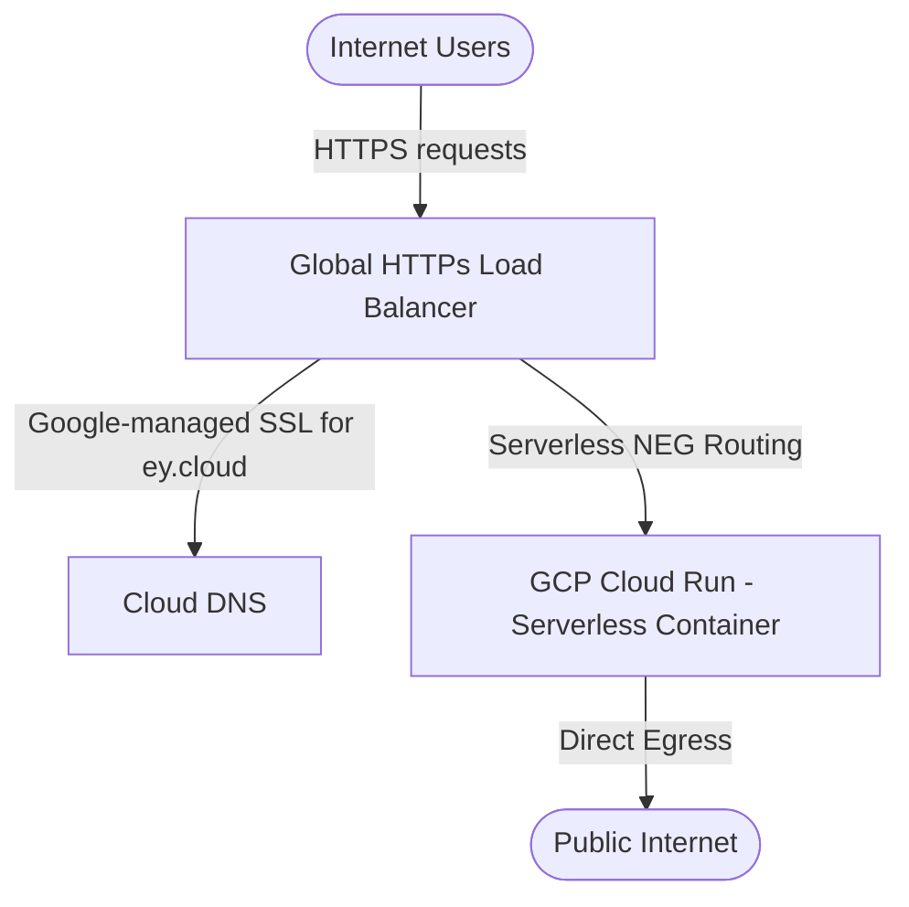

# Eugene Yu (于有志) - Interactive Personal Portfolio

A premium, interactive, bilingual (English & Chinese) personal portfolio website designed for **Eugene Yu (于有志)**, Google Cloud Chief Architect. 

The application utilizes vanilla web technologies to deliver an ultra-fast, immersive, and responsive user experience. It features high-fidelity glassmorphism styling, scrolling animations, real-time mouse-hover 3D tilting effects, and an interactive emulated BASH terminal shell mimicking a live Google Cloud Console.

---

## ⚡ Key Features

1.  **Dual Language System:** Seamless instant EN/ZH localization toggles with state stored persistently in browser `localStorage`.
2.  **Interactive Ambient Canvas:** A dynamic background drawing a network of glowing data points (representing APIs and server grids) connected by faint lines that react to cursor proximity.
3.  **3D Tilt Physics:** Hovering over project cards triggers real-time rotation vectors matching your cursor angle.
4.  **Emulated Cloud Console Terminal:** An interactive virtual BASH console that interprets tech-related commands (type `help` or `帮助` for lists, `about`, `skills`, `projects`, `milestones`, `contact`).
5.  **Ultra-Lightweight & Hardened Dockerization:** Packaged with Nginx Alpine to achieve sub-15MB container footprints and equipped with custom routing, caching, and security headers (CSP, HSTS).

---

## 📊 Researched Data Sources

This portfolio consolidates publicly verified achievements and platforms:
*   **Professional Identity & Bio:** [LinkedIn Profile](https://www.linkedin.com/in/youzhi-eugene-yu/)
*   **Open-Source Laboratories:** [GitHub Profile](https://github.com/eugeneyu) (including repositories: `cdn_prefetch`, `custom-reverse-proxy`, `cloud-demos`, `lianjia-beike-spider`, `DataflowDemos`, `home-environment`).
*   **Industry Influence & Panel Engagements:** 
    *   **XDC 2024 (稀土开发者大会):** Roundtable Panel Guest discussing *"大模型时代的创新与创业机遇"* (GenAI deployment landing, compute cost optimizations, and Google's Responsible AI principles). Reference: [Juejin Conference Report](https://juejin.cn/post/7388177432322310183).
*   **Technical Publications (InfoQ):**
    *   *"如何在公有云环境中使用 VPN 访问谷歌云 API"* (Secure cross-cloud VPC network topology).
    *   *"Transcoder API 自动化视频转码工作流"* (Serverless event-driven media orchestrations).

---

## 💻 Local Development

### 1. Simple Server (Python)
To run a local server in seconds:
```bash
python3 -m http.server 8000
```
Then open [http://localhost:8000](http://localhost:8000) in your browser.

### 2. Docker Container
Ensure Docker is installed locally, then execute:
```bash
# Build the container
docker build -t eugeneyu-portfolio:latest .

# Run the container
docker run -d -p 8080:8080 --name portfolio-site eugeneyu-portfolio:latest
```
Then open [http://localhost:8080](http://localhost:8080).

---

## ☁️ GCP Production Deployment Architecture (`ey.cloud`)

To deploy this portfolio securely at a global scale under the custom domain **`ey.cloud`**, we implement a highly optimized serverless Google Cloud Platform topology. Direct egress is performed straight to the public internet, avoiding NAT overhead, while all ingress is protected behind a Global HTTP(S) Load Balancer mapping back to your Cloud DNS records.



We provide two deployment options: **Automated (recommended)** and **Manual CLI**.

---

### Option A: Automated One-Click Deployment (Recommended)

We have provided a fully automated, idempotent deployment bash script (`deploy.sh`) that takes your domain name as a parameter, provisions all necessary GCP services, compiles and pushes your docker image, and automatically wires your custom DNS record in Cloud DNS.

#### How to Run:
Make the script executable and launch it with your domain name (optionally specify a region, defaulting to `asia-east1`):

```bash
chmod +x deploy.sh
./deploy.sh ey.cloud asia-east1
```

#### What the Script Automates:
1.  **Enables GCP APIs:** Artifact Registry, Cloud Run, Compute Engine (for GCLB), and Cloud DNS.
2.  **Sets up Artifact Registry:** Creates the repository `portfolio-repo` if it does not exist.
3.  **Builds & Pushes Image:** Automatically compiles your local files into Nginx Alpine and pushes them.
4.  **Deploys to Cloud Run:** Limits ingress to `internal-and-cloud-load-balancing` for secure origin delivery.
5.  **Provisions Global Network:** Reserves a static global IP, configures a Serverless NEG, registers a global HTTPS backend service, and hooks a URL Map.
6.  **Deploys Managed SSL Certificate:** Provisions a Google-managed certificate for your domain (`ey.cloud`).
7.  **Auto-Updates DNS Records:** Automatically searches for an active Cloud DNS Managed Zone associated with your domain and transactionally creates/updates your **A-record** pointing directly to your Load Balancer's IP!

---

### Option B: Manual CLI Steps

If you prefer step-by-step control, you can execute the commands manually.

#### Step 1: Set Up Artifact Registry & Push Container Image
1.  Enable Artifact Registry API:
    ```bash
    gcloud services enable artifactregistry.googleapis.com
    ```
2.  Create a Docker repository in your region:
    ```bash
    gcloud artifacts repositories create portfolio-repo \
        --repository-format=docker \
        --location=asia-east1 \
        --description="Docker repository for personal portfolio"
    ```
3.  Configure local Docker to authenticate against GCP registry:
    ```bash
    gcloud auth configure-docker asia-east1-docker.pkg.dev
    ```
4.  Tag and push your local build:
    ```bash
    docker tag eugeneyu-portfolio:latest asia-east1-docker.pkg.dev/[PROJECT_ID]/portfolio-repo/site:v1
    docker push asia-east1-docker.pkg.dev/[PROJECT_ID]/portfolio-repo/site:v1
    ```

#### Step 2: Deploy Container on Cloud Run
We configure Cloud Run to **only** allow traffic flowing from our Global Load Balancer, blocking direct open-internet routes.

```bash
gcloud run deploy portfolio-service \
    --image=asia-east1-docker.pkg.dev/[PROJECT_ID]/portfolio-repo/site:v1 \
    --region=asia-east1 \
    --port=8080 \
    --ingress=internal-and-cloud-load-balancing \
    --allow-unauthenticated
```

#### Step 3: Configure Global HTTP(S) Load Balancer & Serverless NEG
1.  **Create a Serverless Network Endpoint Group (NEG):**
    ```bash
    gcloud compute network-endpoint-groups create portfolio-neg \
        --region=asia-east1 \
        --network-endpoint-type=serverless \
        --cloud-run-service=portfolio-service
    ```
2.  **Create a Backend Service & Add the NEG:**
    ```bash
    gcloud compute backend-services create portfolio-backend \
        --global \
        --load-balancing-scheme=EXTERNAL_MANAGED

    gcloud compute backend-services add-backend portfolio-backend \
        --global \
        --network-endpoint-group=portfolio-neg \
        --network-endpoint-group-region=asia-east1
    ```
3.  **Create a URL Map:**
    ```bash
    gcloud compute url-maps create portfolio-url-map \
        --default-service=portfolio-backend
    ```

#### Step 4: Setup Cloud DNS & Custom Domain with SSL
1.  **Reserve a Static External IP Address:**
    ```bash
    gcloud compute addresses create portfolio-lb-ip --global
    ```
    *(Note down this IP address. We will call it `[LB_IP]`)*
2.  **Create Google-Managed SSL Certificate:**
    ```bash
    gcloud compute ssl-certificates create portfolio-cert \
        --domains=ey.cloud \
        --global
    ```
3.  **Create HTTPS Target Proxy:**
    ```bash
    gcloud compute target-https-proxies create portfolio-https-proxy \
        --url-map=portfolio-url-map \
        --ssl-certificates=portfolio-cert
    ```
4.  **Create Global Forwarding Rule:**
    ```bash
    gcloud compute forwarding-rules create portfolio-https-rule \
        --global \
        --target-https-proxy=portfolio-https-proxy \
        --ports=443 \
        --address=portfolio-lb-ip
    ```
5.  **Configure DNS A-Record in Cloud DNS:**
    Identify your public managed DNS zone on GCP, and create/update an `A-Record` pointing directly to your `[LB_IP]`:
    ```bash
    gcloud dns record-sets create "ey.cloud." \
        --zone="[YOUR_MANAGED_ZONE_NAME]" \
        --type="A" \
        --ttl=300 \
        --rrdatas="[LB_IP]"
    ```
